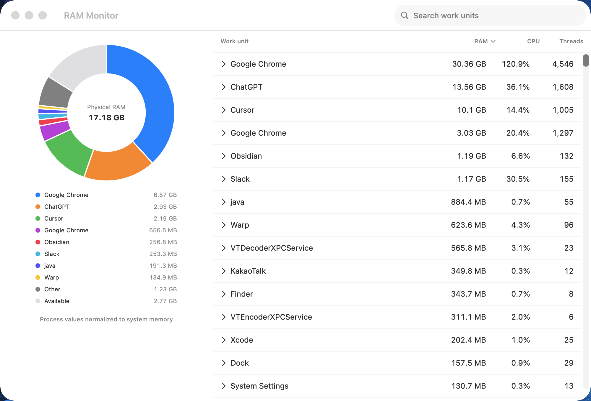

# RAM Monitor

[English](README.md) | [한국어](README.ko.md)

RAM Monitor is a native macOS utility that groups related subprocesses into one work unit so you can see what is actually using your memory. It keeps RAM at the center while retaining live CPU usage, search, sorting, configurable columns, and subprocess inspection.



## Requirements

- macOS 14 Sonoma or later
- Apple Silicon or Intel Mac
- Xcode 16 or later for development
- Homebrew only for development tools or Tap installation

## Memory modes

- **Physical Footprint** is the default. The pie denominator is all physical RAM and includes available and system/unattributed slices.
- **Resident Size** shows resident bytes reported for sampled processes. Its pie denominator is the measured process total, not physical RAM.

The main list uses the same selected metric as the chart. Processes are grouped by bundle identifier when one is available and by exact executable path otherwise.

## Build and run

No paid Apple Developer account or signing certificate is required for local development.

```bash
brew bundle
make bootstrap
make verify
open RAMMonitor.xcodeproj
```

Select the `RAMMonitor` scheme and run it from Xcode, or open the command-line build directly:

```bash
make build
open '.build/DerivedData/Build/Products/Debug/RAM Monitor.app'
```

## Install

Download `RAM-Monitor-X.Y.Z.dmg` from GitHub Releases, open it, and drag **RAM Monitor** into Applications.

Release builds are ad-hoc signed and are not notarized. On first launch, right-click the app and choose **Open**, then confirm **Open**. You can also allow it from **System Settings → Privacy & Security → Open Anyway**.

When a release is available through the personal Tap:

```bash
brew tap logone72/tap
brew install --cask ram-monitor
```

## Build a release

Run the quality gate first, then build an ad-hoc signed Universal 2 release:

```bash
make verify
./scripts/build-release.sh 0.1.0
./scripts/build-release.sh --verify-only release/RAM-Monitor-0.1.0.dmg
```

The script writes the app, DMG, `SHA256SUMS`, and a checksum-pinned `ram-monitor.rb` cask to `release/`. Pushing a `vX.Y.Z` tag runs the same verification and publishes those release assets; copying the generated cask into `logone72/homebrew-tap/Casks/ram-monitor.rb` makes it available from the personal Tap.

## Privacy and permissions

RAM Monitor reads the local process list and Mach process accounting values needed to calculate RAM and CPU usage. The App Sandbox is disabled because a sandboxed process cannot inspect system-wide processes. No process snapshots are written to disk or sent over the network; only UI preferences are stored in `UserDefaults`.

The app does not kill processes, run benchmarks, or collect analytics.

## Development

`make verify` is the single quality gate. It runs swift-format, SwiftLint, whitespace checks, build, unit and UI tests with coverage, and Xcode Analyze. Git hooks run formatting and lint checks before each commit and enforce conventional commit prefixes.

## License

MIT. See [LICENSE](LICENSE).
